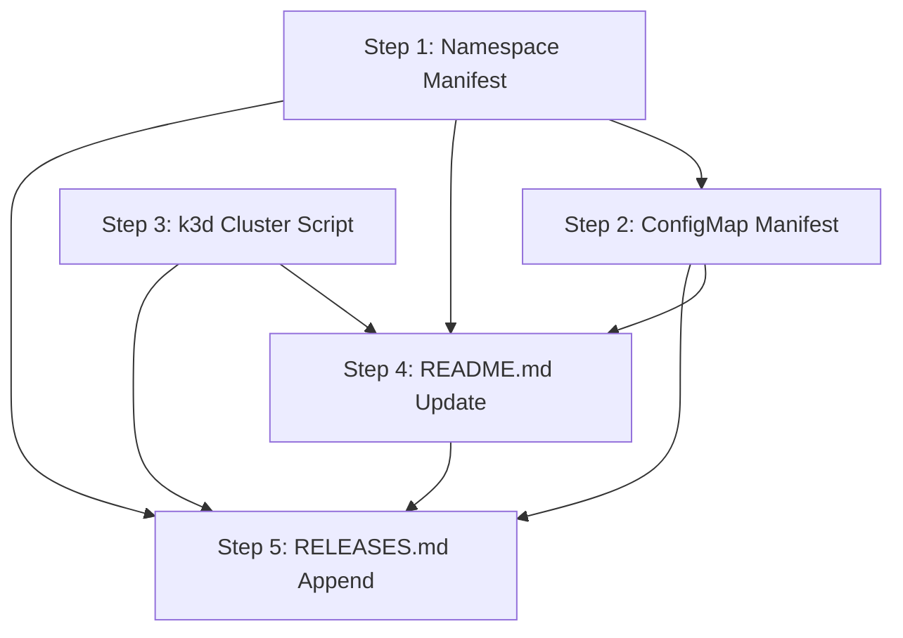

# Implementation Plan: Foundation Layer — Namespace, ConfigMap, k3d Cluster

**Sprint**: SP-001
**Created**: 2026-06-22
**Spec**: SPEC.md
**Status**: Ready for Implementation

## Summary

This plan delivers the three foundational infrastructure artifacts that every Eve Realm component depends on: the `eve-realm` Kubernetes namespace, the `eve-realm-config` shared ConfigMap with 14 environment variables, and the `scripts/k3d-cluster.sh` cluster lifecycle script with five subcommands. All three artifacts are created from scratch — the `k8s/` and `scripts/` directories do not yet exist. The namespace must be applied before the ConfigMap, and both are prerequisites for any plugin deployment in subsequent sprints.

## Entity Coverage

| Entity | Type | Partial | Scope |
|--------|------|---------|-------|
| REQ-001 | requirement | no | Full implementation |
| REQ-002 | requirement | no | Full implementation |
| REQ-003 | requirement | no | Full implementation |
| SC-001 | scenario | no | Full implementation |
| SC-002 | scenario | no | Full implementation |
| SC-003 | scenario | no | Full implementation |
| SC-004 | scenario | no | Full implementation |
| SC-005 | scenario | no | Full implementation |
| SC-006 | scenario | no | Full implementation |
| SC-007 | scenario | no | Full implementation |
| SC-008 | scenario | no | Full implementation |
| SC-009 | scenario | no | Full implementation |
| SC-00A | scenario | no | Full implementation |
| SC-00B | scenario | no | Full implementation |

## Implementation Steps

### Step 1: Kubernetes Namespace Manifest

**Description**: Create the `k8s/` directory and write `k8s/namespace.yaml`. This is the simplest artifact in the sprint and the strict prerequisite for every other manifest — it must be applied first. The manifest declares the `eve-realm` namespace with the `app.kubernetes.io/part-of: eve-realm` label, using plain `kubectl apply`-compatible YAML with no Helm or Kustomize annotations.

**Entities**: REQ-001, SC-001, SC-002

**Files to modify**:
- `k8s/namespace.yaml` (create)

**Acceptance criteria**:
- [ ] `k8s/namespace.yaml` contains `apiVersion: v1`, `kind: Namespace`, `metadata.name: eve-realm`
- [ ] The manifest carries the label `app.kubernetes.io/part-of: eve-realm`
- [ ] No Helm or Kustomize annotations are present in the manifest
- [ ] `kubectl apply -f k8s/namespace.yaml` on a clean cluster creates the namespace with status `Active` (SC-001 AC-1)
- [ ] `kubectl get namespace eve-realm -o jsonpath='{.metadata.labels}'` includes `app.kubernetes.io/part-of: eve-realm` (SC-001 AC-2)
- [ ] Reapplying the manifest exits with code 0 and prints `namespace/eve-realm unchanged` (SC-002 AC-1)
- [ ] After reapply the namespace status remains `Active` and labels are unchanged (SC-002 AC-2)

**Estimated complexity**: S
**Depends on**: None

---

### Step 2: Shared ConfigMap Manifest

**Description**: Create `k8s/configmap.yaml` defining the `eve-realm-config` ConfigMap in the `eve-realm` namespace. The manifest must contain exactly the 14 specified keys with their default values for local k3d development. Internal service URLs (`EVE_REALM_NATS_URL`, `EVE_REALM_NATS_WS_URL`, `EVE_REALM_REDIS_URL`) must follow the K8s DNS pattern `<protocol>://<service-name>.eve-realm.svc.cluster.local:<port>` using `eve-realm-nats` and `eve-realm-redis` as service names. The ConfigMap carries the `app.kubernetes.io/part-of: eve-realm` label.

**Entities**: REQ-002, SC-003, SC-004, SC-005

**Files to modify**:
- `k8s/configmap.yaml` (create)

**Acceptance criteria**:
- [ ] `k8s/configmap.yaml` creates a ConfigMap named `eve-realm-config` in namespace `eve-realm`
- [ ] The manifest contains exactly 14 keys: `EVE_REALM_DSN`, `EVE_REALM_CONTROL_DSN`, `EVE_REALM_LOG_LEVEL`, `EVE_REALM_AUTH_DOMAIN`, `EVE_REALM_AUTH_AUDIENCE`, `EVE_REALM_AUTH_CLIENT_ID_CLI`, `EVE_REALM_AUTH_CLIENT_ID_WEB`, `EVE_REALM_SERVER_URL`, `EVE_REALM_NATS_URL`, `EVE_REALM_NATS_WS_URL`, `EVE_REALM_NATS_PASSWORD`, `EVE_REALM_NATS_BROWSER_TOKEN`, `EVE_REALM_REDIS_URL`, `EVE_REALM_NEO4J_URI`
- [ ] `EVE_REALM_NATS_URL` is `nats://eve-realm-nats.eve-realm.svc.cluster.local:4222`
- [ ] `EVE_REALM_NATS_WS_URL` is `ws://eve-realm-nats.eve-realm.svc.cluster.local:9222`
- [ ] `EVE_REALM_REDIS_URL` is `redis://eve-realm-redis.eve-realm.svc.cluster.local:6379`
- [ ] The manifest carries label `app.kubernetes.io/part-of: eve-realm` and targets `eve-realm` namespace; no Helm or Kustomize annotations are present (REQ-002 AC-6)
- [ ] `kubectl apply -f k8s/configmap.yaml` (after namespace exists) creates the ConfigMap and `kubectl get configmap eve-realm-config -n eve-realm` returns the resource (SC-003 AC-1)
- [ ] `kubectl get configmap eve-realm-config -n eve-realm -o jsonpath='{.data}'` returns all 14 keys with correct default values (SC-003 AC-2)
- [ ] Reapplying the manifest exits with code 0 and prints `configmap/eve-realm-config unchanged` (SC-004 AC-1)
- [ ] After reapply, all 14 keys retain their original values (SC-004 AC-2)
- [ ] `EVE_REALM_NATS_URL`, `EVE_REALM_NATS_WS_URL`, and `EVE_REALM_REDIS_URL` each match pattern `<protocol>://<service-name>.eve-realm.svc.cluster.local:<port>` (SC-005 AC-1)
- [ ] Service name `eve-realm-nats` and port `4222` are used consistently for NATS (SC-005 AC-2)
- [ ] Service name `eve-realm-redis` and port `6379` are used consistently for Redis (SC-005 AC-3)

**Estimated complexity**: S
**Depends on**: Step 1

---

### Step 3: k3d Cluster Lifecycle Script

**Description**: Create the `scripts/` directory and write `scripts/k3d-cluster.sh`. The script must use `#!/usr/bin/env bash` with `set -euo pipefail`, define the five named constants (`CLUSTER_NAME`, `REGISTRY_NAME`, `REGISTRY_PORT`, `API_PORT`, `HTTP_PORT`), and implement each of the five subcommands (`create`, `delete`, `start`, `stop`, `status`) as separate functions. The `create` subcommand guards against duplicate clusters (exits with code 1 and a helpful message when the cluster already exists), creates the registry before the cluster, and passes the required `k3d cluster create` flags. The `delete` subcommand uses `|| true` on both deletion calls for idempotency. The `status` subcommand checks the current kubectl context and skips pod/service queries if it does not match `k3d-eve-realm`. The script must be executable (`chmod +x`).

**Entities**: REQ-003, SC-006, SC-007, SC-008, SC-009, SC-00A, SC-00B

**Files to modify**:
- `scripts/k3d-cluster.sh` (create)

**Acceptance criteria**:
- [ ] Script opens with `#!/usr/bin/env bash` and `set -euo pipefail` (REQ-003 AC-6)
- [ ] Constants defined: `CLUSTER_NAME=eve-realm`, `REGISTRY_NAME=eve-realm-registry.localhost`, `REGISTRY_PORT=5100`, `API_PORT=6550`, `HTTP_PORT=30000` (REQ-003 AC-6)
- [ ] Each subcommand is implemented as a separate named function (REQ-003 AC-6)
- [ ] `scripts/k3d-cluster.sh create` on a clean machine exits with code 0, creates cluster `eve-realm` in `k3d cluster list`, and creates registry `k3d-eve-realm-registry.localhost` in `k3d registry list` (SC-006 AC-1)
- [ ] After `create`, `kubectl cluster-info` reaches the API server and context is set to `eve-realm` cluster (SC-006 AC-2)
- [ ] After `create`, `kubectl get nodes` shows at least one `Ready` node (SC-006 AC-3)
- [ ] `create` output includes registry address `k3d-eve-realm-registry.localhost:5100`, NodePort address with host port 30000, and next-steps instructions (REQ-003 AC-7 / SC-006 AC-4)
- [ ] `create` when cluster already exists exits with code 1 and prints a message suggesting `start` (REQ-003 AC-2 / SC-007 AC-1)
- [ ] After duplicate-guard triggers, `k3d cluster list` shows only one `eve-realm` cluster (SC-007 AC-2)
- [ ] `delete` on an existing cluster exits with code 0; cluster and registry are absent from their respective list commands (SC-008 AC-1)
- [ ] `delete` when cluster and registry do not exist exits with code 0 with no error output (SC-009 AC-1)
- [ ] `stop` followed by `start` exits both with code 0; previously applied Kubernetes resources are preserved after start (SC-00A AC-1, AC-2, AC-3)
- [ ] `status` with matching kubectl context outputs k3d cluster list, k3d registry list, pods in `eve-realm`, and services in `eve-realm` (SC-00B AC-1)
- [ ] `status` with non-matching kubectl context outputs cluster and registry lists but skips pod/service kubectl queries without error (SC-00B AC-2)

**Estimated complexity**: M
**Depends on**: None

---

### Step 4: README.md Update

**Description**: Replace the minimal placeholder README.md with a comprehensive user-facing document covering the project overview, prerequisites, all new artifacts delivered in SP-001, and the getting-started sequence. Sections to include: prerequisites (k3d, kubectl, Docker), project structure, `k8s/namespace.yaml` purpose, `k8s/configmap.yaml` with the full list of 14 environment variable keys and how plugins consume them via `envFrom`, `scripts/k3d-cluster.sh` with all five subcommands and usage examples, Makefile targets (`make cluster-create`, `make cluster-delete`, `make cluster-start`, `make cluster-stop`, `make cluster-status`, `make deploy`), and the getting-started sequence (`make cluster-create` → `make deploy` → `make cluster-status`).

**Entities**: REQ-001, REQ-002, REQ-003

**Files to modify**:
- `README.md` (modify)

**Acceptance criteria**:
- [ ] README.md documents the `eve-realm` namespace and its role as the cluster-wide scope
- [ ] README.md lists all 14 `eve-realm-config` environment variable keys and documents the `envFrom` consumption pattern
- [ ] README.md documents all five `scripts/k3d-cluster.sh` subcommands with usage examples
- [ ] README.md lists Makefile targets: `cluster-create`, `cluster-delete`, `cluster-start`, `cluster-stop`, `cluster-status`, `deploy` with descriptions
- [ ] README.md states prerequisites: k3d v5+, kubectl, Docker running
- [ ] README.md includes the getting-started sequence: `make cluster-create` → `make deploy` → `make cluster-status`
- [ ] README.md is consistent with the implementation delivered in Steps 1–3

**Estimated complexity**: S
**Depends on**: Step 1, Step 2, Step 3

---

### Step 5: RELEASES.md Append

**Description**: Create `RELEASES.md` (it does not yet exist) and append a release entry documenting the SP-001 delivery. The entry records the sprint ID, title, date, a summary of the three artifacts delivered, and all 14 entity IDs included in this sprint.

**Entities**: REQ-001, REQ-002, REQ-003, SC-001, SC-002, SC-003, SC-004, SC-005, SC-006, SC-007, SC-008, SC-009, SC-00A, SC-00B

**Files to modify**:
- `RELEASES.md` (create)

**Acceptance criteria**:
- [ ] `RELEASES.md` has a new entry with sprint ID `SP-001` and the date 2026-06-22
- [ ] Entry lists all 14 entity IDs: REQ-001, REQ-002, REQ-003, SC-001, SC-002, SC-003, SC-004, SC-005, SC-006, SC-007, SC-008, SC-009, SC-00A, SC-00B
- [ ] Entry summarizes the three delivered artifacts: `k8s/namespace.yaml`, `k8s/configmap.yaml` with 14 env vars, `scripts/k3d-cluster.sh` with 5 subcommands

**Estimated complexity**: S
**Depends on**: Step 1, Step 2, Step 3, Step 4

---

## Step Dependency Graph

Steps 1 and 3 are independent and can run in parallel.
