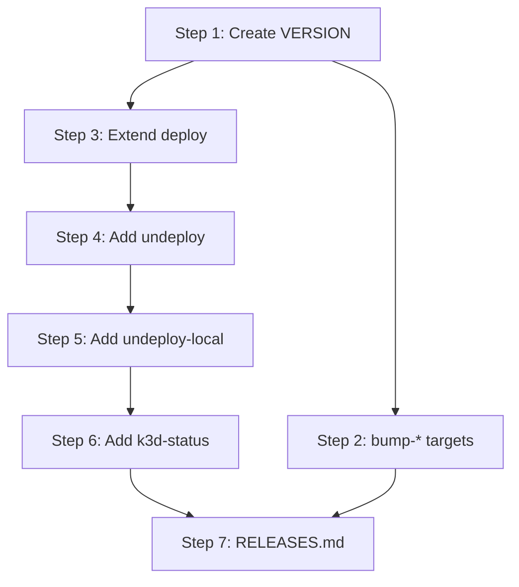

# Implementation Plan: Makefile and Versioning

**Sprint**: SP-002
**Created**: 2026-06-22
**Spec**: SPEC.md
**Status**: Ready for Implementation

## Summary

This plan delivers the complete Makefile tooling for the eve-realm-infra repository. It creates the `VERSION` file with initial value `0.1.0`, adds three semver bump targets (`bump-patch`, `bump-minor`, `bump-major`) using `awk`-based version arithmetic, extends the existing `deploy` target to conditionally apply service directories, and adds `undeploy`, `undeploy-local`, and `k3d-status` targets for the full infrastructure lifecycle. All implementation touches exactly two files: `VERSION` (create) and `Makefile` (modify). SC-012 (Cluster Targets Delegate to k3d Script) is already fully satisfied by the current Makefile and requires no implementation changes.

## Entity Coverage

| Entity  | Type        | Partial | Scope                                                                        |
|---------|-------------|---------|------------------------------------------------------------------------------|
| REQ-004 | requirement | no      | Full implementation — VERSION file + all missing Makefile targets (AC 1-13) |
| SC-00C  | scenario    | no      | bump-patch target: patch component increment                                 |
| SC-00D  | scenario    | no      | bump-minor target: minor increment, patch reset to 0                         |
| SC-00E  | scenario    | no      | bump-major target: major increment, minor and patch reset to 0               |
| SC-00F  | scenario    | no      | deploy target: conditional apply for k8s/nats/ and k8s/redis/               |
| SC-010  | scenario    | no      | undeploy target: delete services with --ignore-not-found, preserve namespace |
| SC-011  | scenario    | no      | undeploy-local target: delete entire eve-realm namespace                     |
| SC-012  | scenario    | no      | Pre-satisfied — cluster-* targets already correct, no changes required       |
| SC-013  | scenario    | no      | k3d-status target: pods, services, events in eve-realm namespace             |

## Pre-Satisfied Entity

**SC-012 (Cluster Targets Delegate to k3d Script)** is fully satisfied by the current Makefile. All five targets (`cluster-create`, `cluster-delete`, `cluster-start`, `cluster-stop`, `cluster-status`) exist and correctly call `./scripts/k3d-cluster.sh <verb>`. REQ-004 AC-8 through AC-12 are also satisfied by these existing targets. No implementation step is required for SC-012; implementers must not modify these targets.

## Implementation Steps

### Step 1: Create VERSION File

**Description**: Create the `VERSION` file at the repository root containing the string `0.1.0` followed by a trailing newline. This file is the single source of truth for the repository's semantic version string. It is a hard prerequisite for the bump-* targets added in Step 2 — those targets read and overwrite this file. No Makefile changes are made in this step.

**Entities**: REQ-004 (AC-1), SC-00C (prerequisite), SC-00D (prerequisite), SC-00E (prerequisite)

**Files to modify**:
- `VERSION` (create)

**Acceptance criteria**:
- [ ] `VERSION` exists at the repository root (`ls VERSION` exits 0)
- [ ] `cat VERSION` outputs exactly `0.1.0`
- [ ] The file ends with a trailing newline (confirmed by `wc -l VERSION` reporting 1)

**Estimated complexity**: S

**Depends on**: None

---

### Step 2: Add bump-patch, bump-minor, bump-major Targets

**Description**: Add three semver bump targets to `Makefile`. Each target reads the current version from `VERSION`, splits it on `.` using `awk -F.`, increments the appropriate component using shell arithmetic, resets lower components to zero where required, and overwrites `VERSION` with the new version string. `bump-patch` increments the third component only. `bump-minor` increments the second component and resets the third to 0. `bump-major` increments the first component and resets the second and third to 0. The `.PHONY` declaration is expanded to include all three new target names.

**Entities**: REQ-004 (AC-2, AC-3, AC-4), SC-00C, SC-00D, SC-00E

**Files to modify**:
- `Makefile` (modify — add bump-patch, bump-minor, bump-major targets; expand .PHONY)

**Acceptance criteria**:
- [ ] Given `VERSION` contains `0.1.0`, running `make bump-patch` produces `VERSION` containing `0.1.1`
- [ ] Given `VERSION` contains `0.1.1`, running `make bump-minor` produces `VERSION` containing `0.2.0`
- [ ] Given `VERSION` contains `0.1.9`, running `make bump-minor` produces `VERSION` containing `0.2.0` (patch resets regardless of its current value)
- [ ] Given `VERSION` contains `0.2.0`, running `make bump-major` produces `VERSION` containing `1.0.0`
- [ ] Given `VERSION` contains `0.9.7`, running `make bump-major` produces `VERSION` containing `1.0.0` (both minor and patch reset unconditionally)
- [ ] All three target names (`bump-patch`, `bump-minor`, `bump-major`) appear in the `.PHONY` declaration
- [ ] Running a bump target when `VERSION` does not exist results in a non-zero exit code

**Estimated complexity**: M

**Depends on**: Step 1

---

### Step 3: Extend deploy Target for Service Directories

**Description**: Extend the existing `deploy` target recipe to conditionally apply `k8s/nats/` and `k8s/redis/` directories after the namespace and configmap steps. The conditional pattern `[ -d k8s/nats ] && kubectl apply -f k8s/nats/ || true` is used so the target succeeds even when those directories do not yet exist in the repository. Application order is fixed: namespace first, configmap second, nats third (if directory present), redis fourth (if directory present). No `.PHONY` change is required since `deploy` is already declared.

**Entities**: REQ-004 (AC-5), SC-00F

**Files to modify**:
- `Makefile` (modify — extend deploy target recipe with conditional service-directory apply steps)

**Acceptance criteria**:
- [ ] The `deploy` recipe applies `k8s/namespace.yaml` before `k8s/configmap.yaml` (order is evident from recipe line sequence)
- [ ] The `deploy` recipe contains a conditional nats apply step that appears after the configmap apply line
- [ ] The `deploy` recipe contains a conditional redis apply step that appears after the nats apply line
- [ ] When `k8s/nats/` does not exist locally, `make deploy` exits with code 0 (dry-verifiable by inspecting the conditional guard)
- [ ] When `k8s/redis/` does not exist locally, `make deploy` exits with code 0
- [ ] The conditional guards use `[ -d k8s/nats ]` and `[ -d k8s/redis ]` (or equivalent) — not bare `kubectl apply` with missing paths

**Estimated complexity**: S

**Depends on**: Step 1

---

### Step 4: Add undeploy Target

**Description**: Add the `undeploy` target to `Makefile`. This target deletes service manifests in `k8s/nats/` and `k8s/redis/` using `kubectl delete -f <dir> --ignore-not-found`, each guarded by a directory existence check (`[ -d k8s/nats ]`) so the target succeeds when manifest directories are absent. The target must not reference `k8s/namespace.yaml` or any configmap resource — the namespace and shared ConfigMap are preserved after undeploy. The `.PHONY` declaration is expanded to include `undeploy`.

**Entities**: REQ-004 (AC-6), SC-010

**Files to modify**:
- `Makefile` (modify — add undeploy target; expand .PHONY)

**Acceptance criteria**:
- [ ] The `undeploy` recipe contains a guarded delete command for `k8s/nats/` with `--ignore-not-found`
- [ ] The `undeploy` recipe contains a guarded delete command for `k8s/redis/` with `--ignore-not-found`
- [ ] The `undeploy` recipe does NOT contain any command referencing `k8s/namespace.yaml` or any configmap manifest
- [ ] When neither `k8s/nats/` nor `k8s/redis/` exist, `make undeploy` exits with code 0
- [ ] `undeploy` appears in the `.PHONY` declaration

**Estimated complexity**: S

**Depends on**: Step 3

---

### Step 5: Add undeploy-local Target

**Description**: Add the `undeploy-local` target to `Makefile`. This target deletes the entire `eve-realm` namespace using `kubectl delete namespace eve-realm --ignore-not-found`. Namespace deletion cascades to all resources it contains, so no individual resource deletion is needed. The `--ignore-not-found` flag makes the target safe to run against a clean cluster. The name `undeploy-local` is intentionally distinct from `undeploy` to signal its destructive scope. The `.PHONY` declaration is expanded to include `undeploy-local`.

**Entities**: REQ-004 (AC-7), SC-011

**Files to modify**:
- `Makefile` (modify — add undeploy-local target; expand .PHONY)

**Acceptance criteria**:
- [ ] The `undeploy-local` recipe contains `kubectl delete namespace eve-realm --ignore-not-found`
- [ ] The recipe contains no individual resource deletion commands — namespace deletion is the sole mechanism
- [ ] When the `eve-realm` namespace does not exist, `make undeploy-local` exits with code 0
- [ ] `undeploy-local` appears in the `.PHONY` declaration

**Estimated complexity**: S

**Depends on**: Step 4

---

### Step 6: Add k3d-status Target

**Description**: Add the `k3d-status` target to `Makefile`. This target runs three sequential `kubectl` commands scoped to `eve-realm`: `kubectl get pods -n eve-realm`, `kubectl get services -n eve-realm`, and `kubectl get events -n eve-realm --sort-by='.lastTimestamp' | tail -20`. The target never invokes `./scripts/k3d-cluster.sh` — it is a direct kubectl namespace view, intentionally distinct from `cluster-status`. The `.PHONY` declaration is expanded to include `k3d-status`. After adding this target, verify the final `.PHONY` line lists all twelve targets.

**Entities**: REQ-004 (AC-13), SC-013

**Files to modify**:
- `Makefile` (modify — add k3d-status target; finalize .PHONY declaration)

**Acceptance criteria**:
- [ ] The `k3d-status` recipe contains `kubectl get pods -n eve-realm`
- [ ] The `k3d-status` recipe contains `kubectl get services -n eve-realm`
- [ ] The `k3d-status` recipe contains `kubectl get events -n eve-realm --sort-by='.lastTimestamp' | tail -20`
- [ ] The `k3d-status` recipe does not call `./scripts/k3d-cluster.sh` in any form
- [ ] `k3d-status` appears in the `.PHONY` declaration
- [ ] The final `.PHONY` line includes all twelve targets: `cluster-create`, `cluster-delete`, `cluster-start`, `cluster-stop`, `cluster-status`, `deploy`, `bump-patch`, `bump-minor`, `bump-major`, `undeploy`, `undeploy-local`, `k3d-status`

**Estimated complexity**: S

**Depends on**: Step 5

---

### Step 7: RELEASES.md Append

**Description**: Append a new release entry to `RELEASES.md` documenting the SP-002 delivery. The entry records the sprint ID, title, date, a prose summary of all changes, and the complete list of entity IDs. SC-012 is noted as pre-satisfied with no implementation changes. Do not read or modify the existing SP-001 entry.

**Entities**: REQ-004, SC-00C, SC-00D, SC-00E, SC-00F, SC-010, SC-011, SC-012, SC-013

**Files to modify**:
- `RELEASES.md` (modify)

**Acceptance criteria**:
- [ ] RELEASES.md contains a new entry with sprint ID `SP-002` and title `Makefile and Versioning`
- [ ] Entry includes the delivery date
- [ ] Entry lists all entity IDs: REQ-004, SC-00C, SC-00D, SC-00E, SC-00F, SC-010, SC-011, SC-012, SC-013
- [ ] Entry summary mentions: VERSION file (initial `0.1.0`), bump-patch/minor/major targets, deploy extension for conditional service-directory apply, undeploy target, undeploy-local target, k3d-status target, and SC-012 pre-satisfied status
- [ ] The existing SP-001 entry is unchanged

**Estimated complexity**: S

**Depends on**: Step 6

---

## Step Dependency Graph

Steps 2 and 3 both depend only on Step 1 and can proceed independently of each other. Steps 4 through 7 form a sequential chain since each step edits `Makefile` and must follow the prior Makefile step to avoid conflicting edits.
